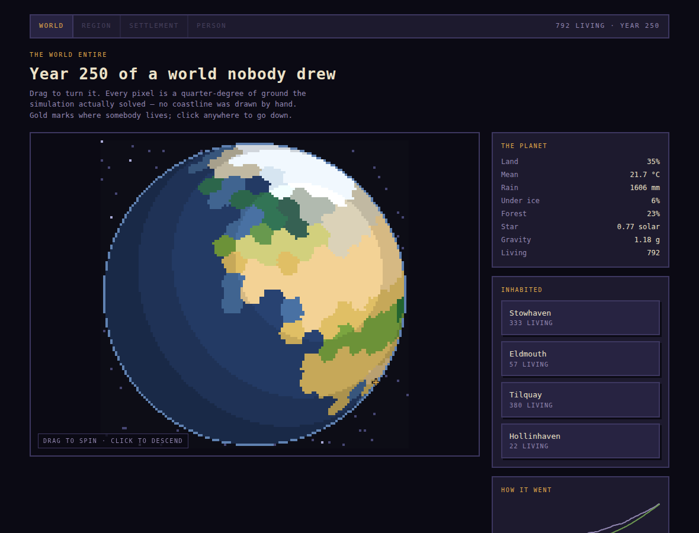
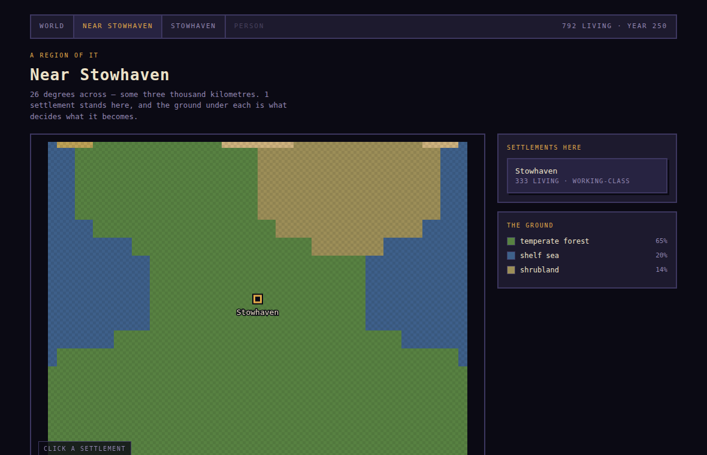
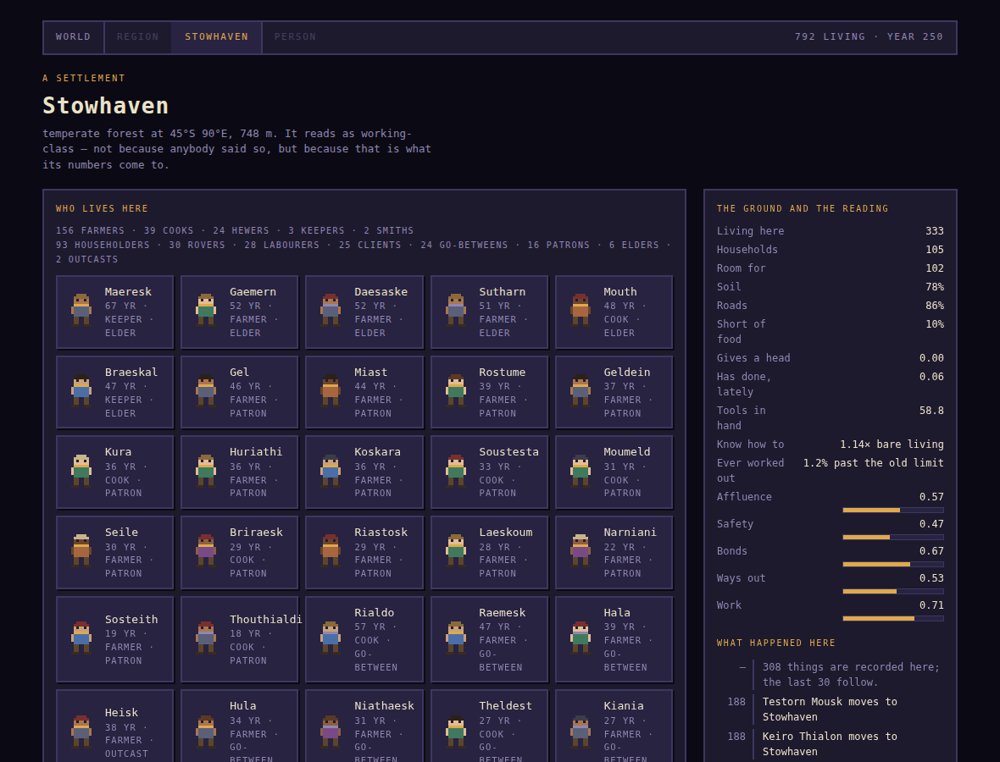
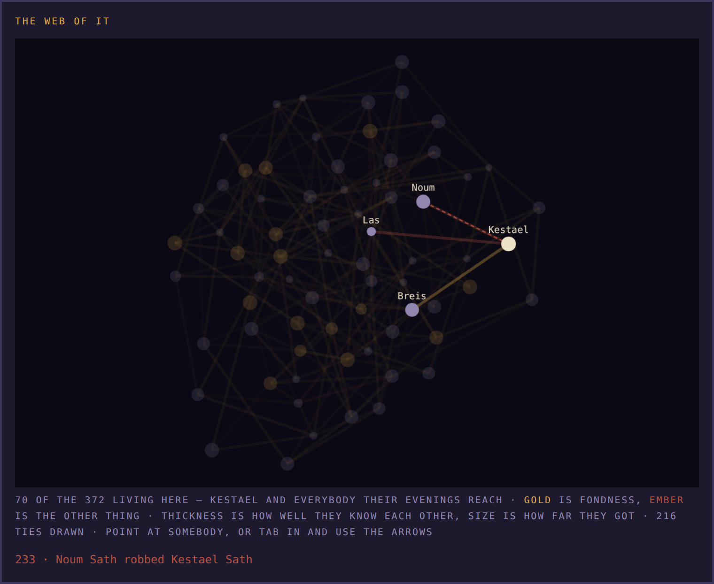
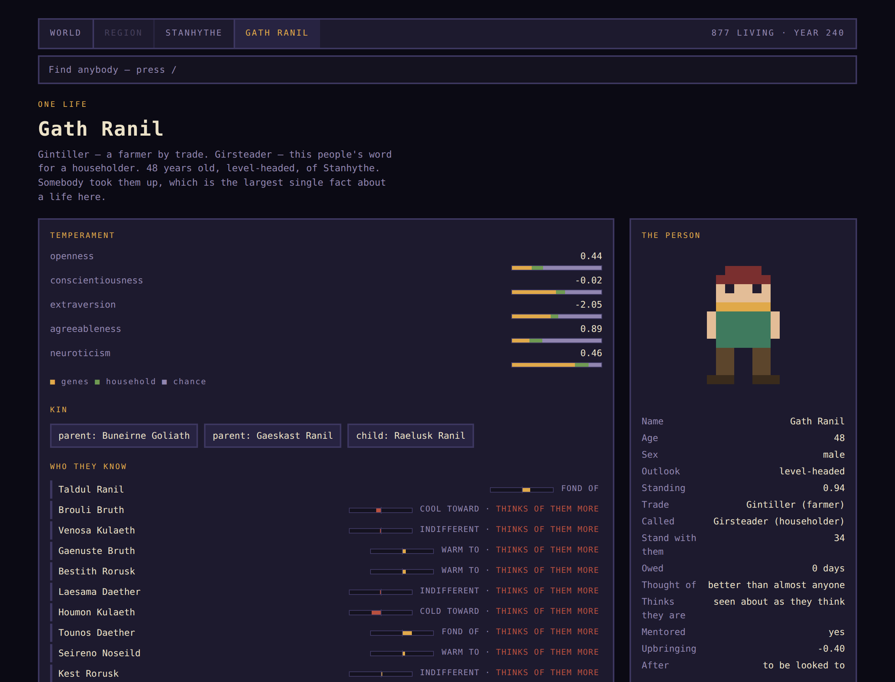
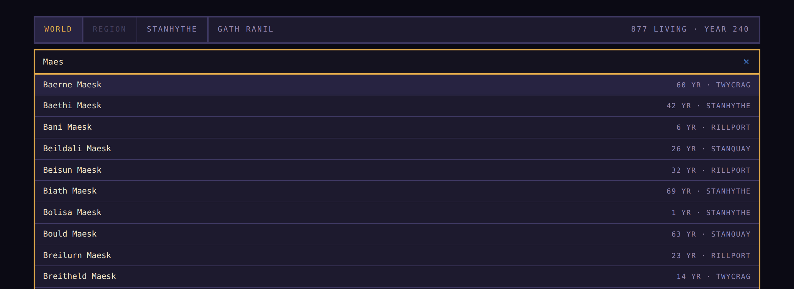

<div align="center">

# life-rs

**A world simulated from plate tectonics down to one person's Tuesday afternoon.**

Continents drift and collide. Climate settles against them. Biomes fall out of the
climate, life radiates and goes extinct, people settle where the ground will feed them —
and then you can stop anywhere in that history, pick one of them out, and ask why they
turned out the way they did.

*Nothing in any of it is placed by hand.*

</div>

<p align="center">
  
</p>

<p align="center"><i>Year 250 of one world. Every pixel is a quarter-degree of ground the simulation solved —<br />no coastline was drawn by hand. Gold marks where somebody lives.</i></p>

---

## Turn it, and go down

The atlas is one self-contained HTML file with the whole world in it. Drag the globe, click
down through **world → region → settlement → person**, and every number on every panel is read
out of the run rather than stored for display.

<table>
<tr>
<td width="50%"></td>
<td width="50%"></td>
</tr>
<tr>
<td><b>A region.</b> Three thousand kilometres across, 65% temperate forest, and one
settlement standing in it — because the ground under a place is what decides whether anybody
can live there.</td>
<td><b>A settlement.</b> 333 people in 105 households on room for 102, and the roll-call is
counted rather than described: 156 farmers, 39 cooks, 24 hewers, 3 keepers, 2 smiths — 16
patrons, 6 elders, 2 outcasts. It reads as <i>working-class</i> because that is what its
numbers come to.</td>
</tr>
</table>

<p align="center">
  
</p>

**The web of a settlement.** Seventy of the 372 people living here and the 216 ties between
them, grown outward from one person along whoever their evenings reach. Gold is fondness, ember
is the other thing, thickness is how well two people know each other, size is how far they got.

Point at somebody and the town drops back behind their own circle. The **dashed red line** is
not a feeling — it is a thing that happened, taken from the chronicle and drawn over the ties
because an act very often runs between two people whose tie has since gone quiet. Underneath the
picture it is written out in words:

> `233 · Noum Sath robbed Kestael Sath`

<p align="center">
  
</p>

**One life, end to end.** Gath Ranil, 48, a farmer — *Gintiller* in his own people's word for
it — householder, taken up by somebody, which the design calls the largest single fact about a
life here. Extraversion **−2.05**, about as far from sociable as this world produces, and
thirty-four people stand with him anyway.

Every person he knows is listed with how warmly, and every one is a link. Eleven of the twelve
carry the note **"thinks of them more"** — he counts them among the people he knows best and
they do not count him. And under *After*, what his life so far adds up to wanting: **to be
looked to**.

<p align="center">
  
</p>

**Nine hundred people, and any of them one keystroke away.** Press `/`, type two letters of any
part of a name. Settlements are in the same list. So are the dead, marked — they are most of the
world by the end, and the point of keeping a chronicle is that they stay readable.

---

## The one rule

**Nothing is authored.** Not a continent, not a country, not a famine, not a title.
Every visible thing has to be the *consequence* of a mechanism rather than a fact
written down somewhere:

| Not this | But this |
| --- | --- |
| A desert placed on the map | Where the moisture doesn't reach |
| An extinction event on a timeline | CO₂ spiked and the oceans went anoxic |
| A "poor neighbourhood" flag | Affluence is what its residents have |
| A village elder appointed | The oldest person others owe favours to |
| A price for grain | What happens to the harvest if one more hand grows it |
| A tech tree | Somebody with a spare year and an odd idea |

When a mechanism turns out to be inert, that gets written down too. The design document
records the ones that were: a discovery ceiling nobody could reach, a crowding penalty that never
once fired, a repayment routine nothing called, and the direction on every tie in the graph.

The same goes for mechanisms that work and still don't ship. **Leaving** — the ability to walk
out of a household, which this world had no way to express — was built, measured, and taken out
again: 2% of pairings ended against a third that had gone cold, which is exactly the shape it was
built for. It broke a claim about friendship, and each of five fixes for that traded one guard
for another. The write-up of why is worth more than the mechanism would have been.

---

## Quick start

```bash
cargo run -p main                                     # a new world, three days
cargo run -p main -- --seed 0x2b --days 5             # replay a specific world
cargo run -p main -- --people 200 --years 60          # a couple of generations
cargo run -p main -- --years 120 --dossier            # end on one person, in depth
cargo run -p main -- --years 120 --balance            # inheritance vs circumstance
cargo run -p main -- --years 200 --atlas > atlas.html # turn a globe, click down to a life
cargo run -p main -- --ages 500                       # half a gigayear, with people on it
```

Every world is reproducible from its seed and genuinely different from every other one.
Same seed, same world, down to the transcript.

---

## What's in it

<table>
<tr><td width="33%">

**The ground**

Plate tectonics · climate solve ·
ocean currents · 15 biomes ·
carrying capacity from real area

</td><td width="33%">

**The living**

256-locus genomes · meiosis ·
Siler mortality · OCEAN
personality · utility-scored
behaviour

</td><td width="33%">

**The social**

Households · directed ties ·
reputation · patronage ·
eight roles · admission
politics

</td></tr>
<tr><td>

**The economy**

Five trades · goods made of
goods · capital that wears ·
regional specialisation ·
barter

</td><td>

**History**

Discovery that moves a limit ·
peoples and countries ·
cultural drift · a chronicle

</td><td>

**The view**

Clickable globe · one life
end to end · a town's history ·
a balance harness

</td></tr>
</table>

**709 tests.** Most of them are about a claim rather than a function.

---

## The ground

Founding a world draws continents from plate motion, solves a climate against them,
reads the biomes off the result, and only then asks where anybody could live.

```
── the planet under them ──
  35% land, 100% of it in one mass, 7 plates, highest point 2054 m
  18.0 °C on average, 5910 ppm carbon dioxide, 6% under ice, 1206 mm of rain a year

── neighbourhoods ──
  Twyport       working-class        afflu 0.41  safety 0.40  jobs 0.53
                └ savanna at 30°N 69°E, 77 m, soil 53%, reach 72%
  Shawtor       rural                afflu 0.24  safety 0.26  jobs 0.44
                └ desert at 32°N 90°E, 1834 m, soil 16%, reach 51%
```

A settlement's carrying capacity is its actual area times what the ground yields there.
Reach — whether anyone passes through — is separate from fertility, because how good a
place is to live is not how many it feeds.

### At the pace of continents

`--ages 500` runs a *populated* world for half a gigayear. The planet moves first and
knows nothing about the people on it; they find out what their ground is afterwards.

```
── what the planet did to them ──
  827 settlements founded, 790 lost
   653 drowned ·  22 frozen · 106 parched ·  9 thrown up
```

That five sixths of all losses are **drownings** is the part nothing aimed at. The best
ground to live on is coastal, because the sea is a road — and coastal is what the sea
takes back.

---

## People

Personality is five continuous traits computed from a genome, a household and chance,
with the three kept apart — so a dossier can say which did what, and *"what if she'd been
raised elsewhere"* is a substitution rather than another lifetime.

```
where their temperament came from:
  openness           -0.68   = genes +0.66  home -0.81  chance -0.52
  conscientiousness  +0.43   = genes +0.43  home -0.81  chance +0.81

  raised badly, conscientiousness would be +0.57; raised well, +1.91 (is +0.43)
```

Behaviour is **scored, not branched**. Every option is priced by need × temperament ×
circadian rhythm × what the place affords, then chosen by softmax — and the prices are
kept, so the simulation can always show its working.

Regression to the mean falls out rather than being applied: parents pass on half their
alleles, not their phenotype.

---

## Places, and sorting

Quarters start identical and unremarkable. Which becomes the enclave and which the slum
comes out of who ends up living there.

- **Archetypes are readings** — the nearest label to a point in the vector space, so a
  neighbourhood can *become* something else, and does.
- **Community and reach are separate.** A poor neighbourhood is not socially empty, it
  is socially *enclosed*.
- **Where you grow up sticks.** Childhood exposure accumulates age-weighted and freezes
  at twenty, so a move at forty barely registers.
- **What draws people is what a place has been like for a generation**, not what its
  harvest did last year — and it is what the *ground gives a head*, not what its
  residents have accumulated. Those are different numbers, and using the second one had
  people moving toward the quarter that was starving them.

---

## Society

There is no government here. Something still decides who gets the good land, and this is
what it is.

```
-- Tilquay: 146 adults
   trades: 25 cook, 116 farmer, 5 keeper   tools in hand: 48.1
   worth taking up: farmer 3.52, hewer 1.02, smith 2.87, cook 5.03, keeper 0.00
   16 go-between, 87 householder, 17 labourer, 1 patron, 25 rover

   Brisiari Mour     Lorsteader (householder)  40  has 0.96  with friends 1.11  38 allies
   Meiskas Vask      Lorspeaker (go-between)   31  has 0.94  with friends 1.09  39 allies

   what Brisiari Mour is owed, and by whom:
     taken up by Gornusko Neskam — warmth +0.55, 0 days still owed

   108 circles, largest 7
     [2.70] Lusithe Laen, Lol Vast, Brouldis Thialon, Nal Naemel, Diastia Naemel, …
```

- **Ties are directed, and it turns out nothing in them is.** `bonds` opens by arguing that a
  tie must run one way because unrequited regard is the ordinary case. Building the atlas's tie
  list meant measuring it: over **6,002 pairs**, the median gap between what A holds about B and
  what B holds about A is **0.000** on warmth, 0.003 on regard, 0.000 on knowing, and debt is
  exactly antisymmetric by construction. Liking here is always mutual — not usually, *always* —
  because the rule that moves it steps both sides at once from identical starting values.

  What *is* asymmetric is attention: better than a third of ties are one where you count somebody
  among the people you know best and they do not count you. That is the sadder and truer thing,
  and it is the one the atlas shows. The comment has been corrected; the claim is gone.
- **Reputation is transitive regard** — it travels between people who have never met.
  Gossip with no words in it.
- **Patronage is real.** Somebody takes you up, and it is the single largest fact about
  a life here.
- **Politics is admission.** A door that does not open for somebody the neighbours have
  turned against. There is still no law and no court, and that is what makes reputation
  worth having.
- **A faction is a clique, not a component.** Mutual affection percolates: above a mean
  degree of one, "everyone connected to everyone" is the whole town and means nothing.

### Roles and titles

Eight positions — elder, patron, go-between, client, labourer, rover, outcast,
householder — **read out of the state each time and never stored**, so a position can be
lost, and when its holder dies somebody else is read into it. Each is ranked against the
neighbours rather than against a number, so a rich man in a poor village is the patron.

And every people has **its own word** for each: *Lorsteader*, *Lorspeaker*.

### Things people do to each other

Everything above is something people do to *the world*. This is the part where somebody
picks a person and does something to them on purpose.

```
  acts       gave to 819  taught 161  shunned 285  robbed 88  killed 6
  withheld     4510   times somebody turned away from a neighbour visibly worse off
  killed          6   deaths by another person's hand
```

Eight worlds, ninety years, two thousand people. Five acts, each aimed at somebody, each
scored from who the actor is and what they hold about the target:

- **Kindness reaches a stranger.** Giving is the one act that does not need a tie, so a
  benevolent person helps somebody they have never met.
- **Violence needs both halves of a sentence.** They hate them, *and* they have nothing
  left to lose — which is a computed quantity: what people would take from you, who needs
  you, how much life you have left. One anchor is enough. A man with a child to feed is
  held by that alone, however poor and sick and friendless he is.
- **Harm is wrong everywhere; obligation is local.** What you owe the person in front of
  you is read off how a people spends its days, so it drifts as they drift. Somebody who
  moves can transgress **without knowing they have** — withholding exactly as they always
  did, in a place where that is not done, judged by a standard they never learned.
- **Conscience needs no witnesses.** A wrong is kept by whoever did it, always, and what
  that memory does is make the next one dearer. It fades on the same hyperbolic curve
  everything else does, so a wrong done at twenty faintly restrains at sixty.
- **Nobody sees a killing.** This world has no way for one person to tell another a fact,
  so the killer is the only person who ever knows. Every murder here is unsolved.

Switch the whole vocabulary off and the world lands where it landed with it — same
population, same churn, same settlement concentration, same trade mix. That took **five
corrections**, and every one of them was the same mistake: two quantities not on a common
scale, used as though they were. Two are worth the price of admission:

- For a long time **murder was structurally impossible**. Shunning and killing run off the
  same hatred, shunning is far cheaper, and taking the larger appetite meant the cheap
  sanction masked the grave one every single time. No amount of tuning fixes that.
- Teaching wrote a person's *standing* into a childhood-quality predictor centred on zero,
  so being taught by a middling neighbour counted as a better upbringing than being raised
  in the best quarter in the world. Nothing in the aggregates noticed. **A calibration band
  did** — the share of a life that upbringing explains dropped from 0.25 to 0.19 and went
  under its floor, and running the same three worlds with the vocabulary switched off is
  what turned that into an address.

All five are written up in the design document.

---

## Work

Goods made out of goods: food needs tools, tools need stock, stock needs hewing, meals
need cooks, everything needs keepers. Capital wears out and compounds.

Nothing is priced. What a trade is *worth taking up* is found by re-running the year with
one more hand in it and seeing what happens — because a price nobody quotes is still a
comparison somebody makes.

The one attempt at authored prices produced fifty-one cooks against forty-seven farmers
and cost a third of the population. It is in the design document, along with the three
separate ways the chain refused to start.

---

## Discovery

Every world used to be permanently medieval, because technique had a hard ceiling. Now
the ceiling is a **frontier**, and one thing moves it: somebody works something out.

Four things decide whether anybody ever does, and none of them is a date —

- **Slack.** A year not spent staying alive. The Malthusian trap is a trap precisely
  because the surplus that would buy thinking gets eaten by the children it also buys.
- **Openness.** The only place a personality trait decides something that outlives the
  person who has it.
- **Numbers.** More people have more ideas — and, through a carrier threshold, more
  people are needed to hold on to them. A lone genius in a hamlet is a lost idea.
- **What they do all day.** An advance is in the discoverer's own trade. A world of
  farmers gets better at farming and at nothing else.

It reads out like any other event in a life: *"Vasta Laen works out a better way to make
tools."* No tree, no prerequisites, no name for the thing discovered.

---

## The omniscient view

A queryable observer that never perturbs the run — and an atlas you can turn and click
down through: **world → region → settlement → person.**

```
  place        reads as            afflu safety   bond bridge   jobs hholds
  Northside    working-class        0.14   0.23   0.87   0.18   0.40    31
  The Wharf    working-class        0.43   0.35   0.74   0.51   0.65    89
  Elmhurst     rural                0.03   0.25   0.93   0.07   0.31     0
```

A person's page shows **one life end to end** — the chronicle filtered by that
participant. A settlement's shows the same chronicle filtered by place. Neither is a
separate record; a biography is an angle on the log.

That view earns its keep. Printing one woman's life in order turned up three defects in
one afternoon that seven hundred tests could not see, because each was symmetric in the
population and cancelled in every aggregate — households commuting between two towns for
their whole lives, a documented negative feedback that had never fired, and a migration
rule reading the one number that pointed the wrong way.

### Level of detail

People in places nobody is watching stop deliberating every few hours and live a year at
a time instead.

```
300 people, 150 years
  every place watched   52.7 s
  none watched           0.7 s     — 73×
```

The coarse year is a **projection, not an approximation**: work compounds in closed form,
so a population simulated coarsely lands where the same population simulated finely
lands. That equivalence is a test, because *a world that quietly changes while you are
not looking is one you cannot trust when you look back at it.*

One known cost, measured rather than hidden: a coarsely lived year keeps needs where a
competent adult maintains them, so nobody unwatched ever has a bad month — about a fifth
more population over 150 years.

---

## The balance harness

The question the whole design is built around: **is this a story about inheritance or
about circumstance?**

Measured over three worlds at 160 founders and 120 years:

| seed | genes | upbringing | luck | elasticity | siblings | mobility | gap |
| --- | --- | --- | --- | --- | --- | --- | --- |
| `0x11` | 0.50 | 0.42 | 0.40 | 0.69 | 0.47 | 0.69 | 1.13 |
| `0x21` | 0.45 | 0.23 | 0.51 | 0.56 | 0.36 | 0.70 | 0.72 |
| `0x221` | 0.33 | 0.20 | 0.59 | 0.41 | 0.19 | 0.61 | 0.61 |

Neither cause decides a life, which is the claim. Two of the seven — luck and
intergenerational elasticity — sit outside the bands the design commits to, and are
reported rather than tuned away.

**Four of the seven change band between seeds.** A few hundred lives is a small sample
and its statistics wander, so a single world reading "within target" is close to no
evidence. The `--balance` sheet now says so on its own last line.

### A frontier, not an optimum

Escape routes — windfalls, the young who will uproot for work, patrons who open doors —
work by decoupling where somebody ends up from where they began. So anything that lowers
elasticity also lowers how much upbringing can explain, and raises what is left to chance:

| escape routes | elasticity | genes | circumstance | luck |
| --- | --- | --- | --- | --- |
| off | 0.62 | 0.39 | 0.39 | 0.46 |
| **as shipped** | **0.55** | **0.42** | **0.37** | **0.46** |
| stronger | 0.40 | 0.41 | 0.15 | 0.55 |
| stronger still | 0.33 | 0.39 | 0.07 | 0.59 |

The design wants low elasticity *and* circumstance near 0.40 *and* luck near 0.30. This
model cannot give all three at once. The shipped values buy the central claim and leave
the other two a little outside, which the harness reports rather than hides.

---

## Architecture

Twenty-odd crates, each one a thing the world is made of rather than a layer of the
program:

```
sim-core                     handles, arenas, seeded randomness, the time ladder, the chronicle
cosmos planet                a star, a world, a clock
geo climate ocean biome      the ground and what happens on it
settlement                   where anybody could actually live, and how many
life evolution ecology       genomes at population scale, food webs, deep time
genetics person              one genome, one mind
society bonds culture        households and neighbourhoods; who knows whom; what a people does differently
work economy                 goods made of goods, trades, technique
sim                          the World that owns all of it
observer main                asking it questions, and drawing the answers
```

Three foundations everything else stands on:

- **No borrowed references.** A person holds `home: PlanetId`, not `&Planet`. Cycles —
  families, food webs — are representable at all.
- **Reproducible worlds.** Every draw descends from the world seed; nothing calls
  `thread_rng()`.
- **Time that reaches deep.** Integer simulated seconds, no drift over 10¹³ steps. Day
  phase is *derived* from the clock, so it cannot fall out of step. An empty world
  crosses a million years instantly, and nothing is polled — ~7.8M events/sec on one core.

---

## Roadmap

1. **A world that lives** — handle-based world, scale ladder, person depth, genetics, families
2. **A world that has places** — geodesic grid, tectonics, climate, oceans, biomes, ecology, neighbourhoods
3. **A world you can watch** — chronicle, observer API, atlas, level of detail
4. **A world with history** — evolution, speciation, deep time, globe rendering, continuous zoom

**→ [`docs/DESIGN.md`](docs/DESIGN.md)** is the long version: the architecture, every
mechanism, and — at greater length than the mechanisms — the measurements that showed
which ones were wrong.

<details>
<summary><b>The original Phase 1 notes</b>, kept as the record of where this started</summary>

### Phase 1: Static World and People

This phase should allow the creation of a world with livable properties that contain
people with detailed properties. At this stage there should be no interactions between
the world and the people, aside from the acknowledgement from the people that they exist
on that world. The idea in this phase is that people act like they live in a box, while
they desire to eat and sleep, they do not have the desire or the ability to talk or
interact with anything else.

- what does persons need to have
  - name
  - to feel/know when they are hungry
  - to feel/know when they are tired
  - some additional properties relate to occupation
  - gender
  - country of origin
  - ethnicity
- What does the planet need to have
  - Planet keeps track of time of day/clock

</details>
